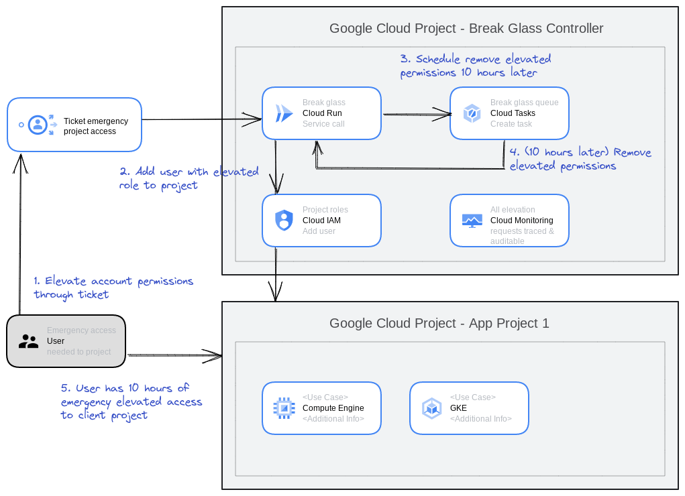

# Google Cloud Break Glass Service (Pybreak)

This is small solution to external systems to grant emergency elevated rights (break glass) to Google Cloud projects through a microservice API (written in Python, hence the name Pybreak). The rights are also automatically revoked after 10 hours, and the elevation logged for operations and auditing purposes.

## QuickStart- Cloud Shell setup tutorial

Use the following GCP CloudShell tutorial, and follow the instructions.

## Manual deployment

To deploy manually, just make sure you are authorized in gcloud and then follow these steps.

1. Change the project ID to your project in 1_env.sh and call `source 1_env.sh`
2. Run the second script to create the user and role assignments `./2_create_resources.sh`
3. Run the third script `./3_deploy.sh` to deploy the microservice to Cloud Run

## Using and integrating

After deployment, the service can be called by any system that needs to request elevated access for a user and project (see the API docs in [./docs/breakglass-oapi-v1.yaml](./docs/breakglass-oapi-v1.yaml). The authentication is by default [OIDC authentication provided by Cloud Run](https://cloud.google.com/run/docs/authenticating/service-to-service) using the created **breakglassservice** service account. This can be adapted or changed depending on hosting and needed authentication (auth needs to be done outside of the microservice).

## Architecture

This solution is inspired by this solution for [Google Cloud Just-In-Time Access](https://cloud.google.com/architecture/manage-just-in-time-privileged-access-to-project), but simplifies it down to a simple API that can be deployed to Cloud Run or GKE and triggered by an external system, such as a ticket management or identity management system.

Here is an architecture diagram:

The solution is based on a Python microservice that uses the Google Cloud Python SDK to give a user temporary elevated access to a project based on an API call, and then uses [Google Cloud Tasks](https://cloud.google.com/tasks) to configure the revokation of the elevated rights 10 hours later. This way a user gets only elevated rights for a limited amount of time for critical emergencies, and then is automatically removed afterwards.

The microservice also uses [Google Cloud Logging](https://cloud.google.com/logging) to record all operations for future auditing and monitoring purposes.

## Support

This is not an official Google product.